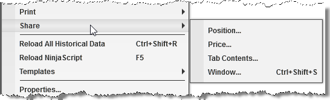
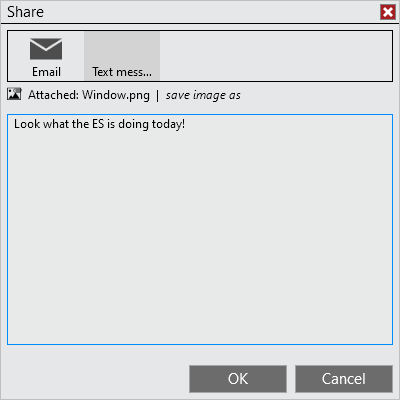
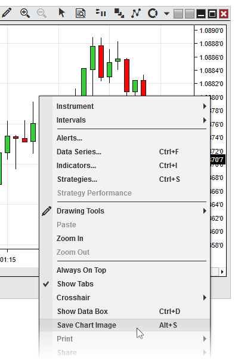


Operations > Windows > Sharing Content

Sharing Content

| << [Click to Display Table of Contents](sharing_content.md) >> **Navigation:**     [Operations](operations-1.md) > [Windows](window_tabs-1.md) > Sharing Content | [Previous page](using_tabs-1.md) [Return to chapter overview](window_tabs-1.md) [Next page](printing_content-1.md) |
| --- | --- |
NinjaTrader support sharing messages and images via Email or Text message via email. 
## 

| playVideo |
| --- |
|  |
 
## Setting up Sharing Services
You must first setup your sharing services before you are able to share content.
 
In the NinjaTrader Control Center under the "Tools" menu select "Options", here in the General category you can click to configure "Sharing Connections".

## Options_SharingServicesObjectDialog
## 
Select an available sharing service and double click or select "add" to configure that connection.
Once you have completed setup of the sharing service. You can now use this sharing service in NinjaTrader. 
 

| Note: The default check box can only be checked for a single account for each Sharing Services. This is the account that is used when any automated process attempts to share something, such as an strategy tweeting a new position is just got into. For more information on the NinjaScript method to share please see the following section of the help guide. |
| --- |
## 
## Sharing from a NinjaTrader Window

 
Right clicking on a NinjaTrader window that has sharing enabled you will see the the "Share" menu. On mouse over the "Share" all items that you can share will be available for selection. In the screenshot you have the following actions available, however please note that these will change depending on the window context you have right clicked in. 
 

| Position... | Opens the share window with the current instrument position pre populated for message. |
| --- | --- |
| Price... | Opens the share window with the current instrument price pre populated for message. |
| Tab Contents... | Opens the share window with a screenshot of the tab attached to the message. |
| Window... | Opens the share window with a screenshot of the window attached to the message. |
 
Once you make a selection the Share dialog will be launched where you can customize the message and select what service you would like to share too. 
 

 

| Note: Depending on what the window supports for sharing will change depending on what options you have for sharing for that window. |
| --- |
## 
## Saving Chart Images
In addition to sharing directly through NinjaTrader, you can also save images of chart windows to your PC locally, which you can store or share in other ways.
 
To save a chart image, first right click within the chart canvas area, then click "Save As Image," as seen in the screenshot below:
 

