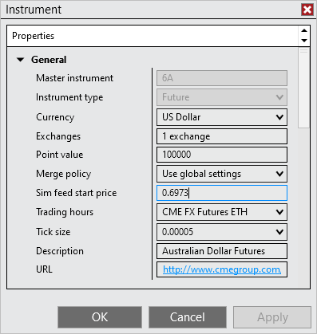
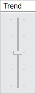


Configuration \> Connecting \> Multi\-provider Connections \> Simulated Data Feed Connection

Simulated Data Feed Connection

| \<\< [Click to Display Table of Contents](simulated_data_feed_connection.md) \>\> **Navigation:**     [Configuration](configuration.md) \> [Connecting](connecting.md) \> [Multi\-provider Connections](multi-provider-connections.md) \> Simulated Data Feed Connection | [Previous page](external_data_feed_connection.md) [Return to chapter overview](multi-provider-connections.md) [Next page](options.md) |
| --- | --- |
## Simulated Data Feed Connection
The Simulated Data Feed connection is a default connection installed with NinjaTrader. Its purpose is to play internally generated market data for simulation. 
 
This connection can be used for:
 
- Offline simulated training and practice of NinjaTrader 

- Offline testing of strategies 

- Offline testing of trade automation using NinjaScript strategies or the NinjaTrader [Automated Trading Interface](automated_trading_interface_at.md) 

## 

| Notes: 1\.This connection is a random internally generated market and has NO correlation to real market data2\.This connection does not provide historical data |
| --- |
 

| Tip: The Simulated Data Feed will continuously run and generate data once connected and drive all NinjaTrader windows, however please keep in mind the [Trading Hours](tradinghours.md) definitions used will still govern for which time periods your window (i.e. Chart, Market Analyzer, SuperDOM Indicators and Columns) can receive the data to display. |
| --- |
 
## Sim Feed Start Price
The Simulated Data Feed will automatically use the last price from the last connection as the starting price for the instrument.
 

 
## Defining the Sim Feed Start Price
To manually set an instrument starting price for use with the Simulated Data Feed:
 
1\.Left mouse click on the Tools menu in the Control Center and select the Instrument menu item 

2\.Search for the desired instrument and select it

3\.Press the edit button and set a Sim feed start price value

 
Once you are connected to the Simulated Data Feed connection, the instrument will begin simulated trading at the Sim feed start price value. 
## 
## Trend Slider
The Trend slider control will appear once connected to the Simulated Data Feed. Left mouse click on the slider and drag it up or down to cause the Simulated Data Feed to move in that direction.
 

