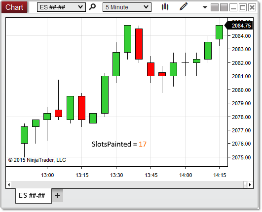


NinjaScript > Language Reference > Common > Charts > ChartControl > SlotsPainted

SlotsPainted

| << [Click to Display Table of Contents](slotspainted.md) >> **Navigation:**     [NinjaScript](ninjascript-1.md) > [Language Reference](language_reference_wip-1.md) > [Common](common-1.md) > [Charts](chart-1.md) > [ChartControl](chartcontrol-1.md) > SlotsPainted | [Previous page](chartcontrol_properties-1.md) [Return to chapter overview](chartcontrol-1.md) [Next page](chartcontrol_strategies-1.md) |
| --- | --- |
## Definition
Indicates the number of index slots in which bars are painted within the chart canvas area. This covers the visible portion of the chart only, and does not include historical painted bars outside of the visible area. 
## 
## Property Value
An int representing the number of index slots in which bars are painted
## 
## Syntax
<ChartControl>.SlotsPainted
## 
## Examples

| ns |
| --- |
| protected override void OnRender(ChartControl chartControl, ChartScale chartScale) {    int painted = chartControl.SlotsPainted;      // Print the number of bars painted on the visible chart canvas    Print(painted); } |

In the image below, SlotsPainted reveals that there are 17 bars painted on the chart canvas.
 

