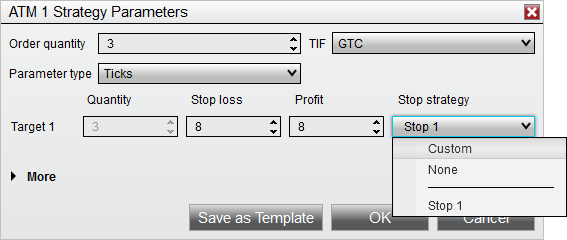
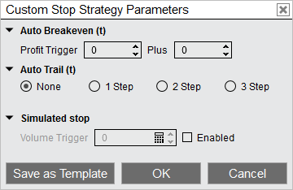



Operations \> Advanced Trade Management (ATM) \> ATM Strategy \> Stop Strategy

Stop Strategy

| \<\< [Click to Display Table of Contents](stop_strategy.md) \>\> **Navigation:**     [Operations](operations.md) \> [Advanced Trade Management (ATM)](advanced_trade_management_atm.md) \> [ATM Strategy](atm_strategy.md) \> Stop Strategy | [Previous page](atm_strategy_selection_mode.md) [Return to chapter overview](atm_strategy.md) [Next page](auto_breakeven.md) |
| --- | --- |

## ATM Stop Strategies

## ATM Stop Strategies provide additional functionality for the stop losses placed by an ATM Strategy, including [auto\-breakeven](auto_breakeven.md), [auto\-trail](auto_trail.md), and [Simulated Stop](simulated_stop_orders.md) orders.

## 

| playVideo |
| --- |
|  |

 

A Stop Strategy is an extension of an ATM Strategy. It allows you to combine [Auto Breakeven](auto_breakeven.md), [Auto Trail](auto_trail.md), and [Simulated Stop](simulated_stop_orders.md) strategies for the management and automatic adjustment of your Stop Loss orders.

 

When setting up an ATM Strategy, you can select either \<Custom\>, \<None\>, or any pre\-defined Stop Strategy template from the Stop Strategy control list.

 

 

If \<Custom\> or any template is selected ("Stop 1" in the image below is a template) a Stop Strategy Dialog window will appear.

 

 

You can enter the appropriate values to enable any of the Stop Loss automation strategies. You can also save commonly used parameters as a Stop Strategy template.

 

| Note: The parameter type of Currency or Price cannot be used for stop strategies. Tick will be used instead, which is indicated by the (t) next to Auto Breakeven and Auto Trail in the stop strategy parameters. |
| --- |

