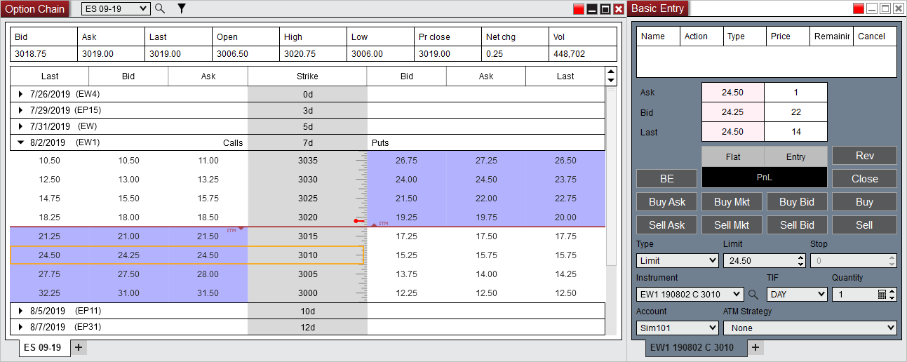



Operations \> Option Chain \> Submitting Orders

Submitting Orders

| \<\< [Click to Display Table of Contents](submitting_orders_option_chain.md) \>\> **Navigation:**     [Operations](operations-1.md) \> [Option Chain](option-chain-1.md) \> Submitting Orders | [Previous page](display_overview_option_chain-1.md) [Return to chapter overview](option-chain-1.md) [Next page](properties_option_chain-1.md) |
| --- | --- |

[Show/Hide Hidden Text](javascript:HMToggleExpandAll(!HMAnyToggleOpen()) "Click to open/close expanding sections")

Submitting options orders is done by linking an order entry window then clicking on a bid or ask price within the options quotes section of the Option Chain. For more information on the order entry windows please see the [Order Entry](order_entry-1.md) section of the user help guide.

 

 

        [How to link the Option Chain to an order entry window](javascript:HMToggle('toggle','HowtolinktheOptionChaintoanorderentrywindow','HowtolinktheOptionChaintoanorderentrywindow_ICON'))

| You can link the Option Chain window to an order entry window by  1\) Setting a link color in the Option Chain window  2\) Then setting a matching link color in an order entry window   For more information on window linking please see the [Using Window Linking](linking_windows-1.md) section of the user help guide.   OptionsChain8   To load the desired options in the order entry window 3\) Click on the Bid or Ask price within the options quotes at the desired Strike price on the Calls or Puts side 4\) The options instrument will then automatically be populated into the Instrument drop down menu of the order entry window   OptionsChain9 |
| --- |

