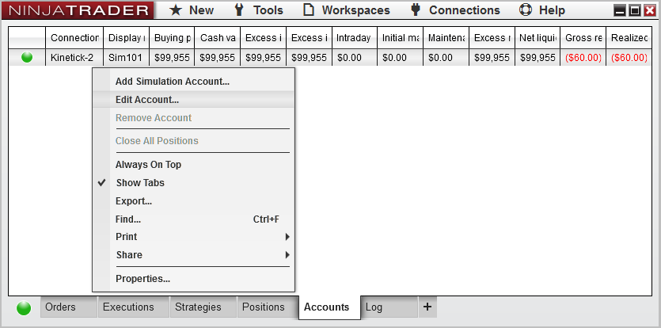
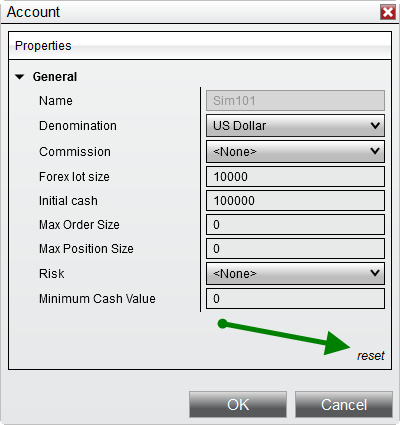



Operations \> Simulator \> The Sim101 Account

The Sim101 Account

| \<\< [Click to Display Table of Contents](the_sim101_account.md) \>\> **Navigation:**     [Operations](operations.md) \> [Simulator](simulation.md) \> The Sim101 Account | [Previous page](simulation.md) [Return to chapter overview](simulation.md) [Next page](multiple_simulation_accounts.md) |
| --- | --- |

## What is the Sim101 account?

The Sim101 account is a default account that represents your own simulated account through which you place simulated trades. The Sim101 account behaves identical to a live account in that it has a cash balance, profit and loss and other financial parameters. For example, when placing orders to the simulator, the Sim101 account is checked to ensure that you are not exceeding your buying power.

## 

## How to customize the Sim101 account

You can set initial Sim101 account values, reset simulator values, and clear order history. To access these settings open the Control Center window select the "Accounts" tab. If the account tab is not visible select the "\+" tab button and select 'New accounts'

 

 

## Resetting Initial Cash value on the Sim101 account

To reset the initial cash value on your account please edit the account as shown above.

 

 

In the Simulation Accounts window:

1\.Set the "Initial cash" property to what you want to reset the account to. 

2\.Click "reset"

 

| Note: Simulation Denomination currently only supports US Dollar. |
| --- |

