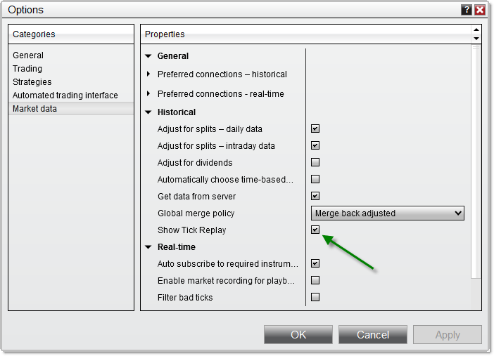
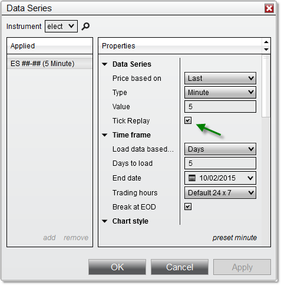


Operations \> Charts \> Tick Replay
Tick Replay
| \<\< [Click to Display Table of Contents](tick_replay.md) \>\> **Navigation:**     [Operations](operations-1.md) \> [Charts](charts-1.md) \> Tick Replay | [Previous page](order_flow_market_depth_map-1.md) [Return to chapter overview](charts-1.md) [Next page](power_volume_indicators-1.md) |
| --- | --- |
## What is Tick Replay?
Tick replay is a property that can be optionally enabled on NinjaScript indicators and strategies which will ensure that the market data (bid/ask/last) that went into building a bar is loaded in the exact sequence of market data events.  This guarantees that your indicators and strategies are historically calculated tick\-per\-tick exactly as they would have been if the indicator/strategy was running live during a period. Tick replay can be enabled for indicators used in Charts, Market Analyzers, and Strategies.
 
| Warning: It is important to note that this property implies that more PC resources are used to calculate your indicators and strategies and as a result will lead to a performance impact. The tick replay setting should only be reserved for indicators and strategies which would truly benefit from the additional resources dedicated to arrive at these calculations.     For example, a simple Pivot indicator which just uses the current and previous daily price levels would not see any advantage from using tick replay.  In contrast, a Volume profile indicator which relies on the exact sequence of trades to calculate various levels would greatly benefit from using tick replay. |
| --- |

## 
| Note: Tick Replay is not intended to function in NinjaScript strategy backtests, and will not provide the same results as running a strategy on live data with Tick Replay enabled. For greater order\-fill resolution in strategy backtests, you can use the High Fill Resolution in the Strategy Analyzer. |
| --- |

## 
Indicators and Strategies will only be able to take advantage of tick replay if they have been explicitly programmed to calculate these market data events.  If you are a programmer and would like to learn how to use Tick Replay with your custom scripts, please see the [using tick replay](developing_for__tick_replay-1.md) section of our NinjaScript Help Guide.
## 
## Setting up Tick Replay
By default, tick replay will not be enabled.  In order to expose this property for your indicators and strategies, you will first need turn on the global tick replay option:
 
- Navigate to the Control Center \> Tools \> Options menu, and under the Market data category, check "Show Tick Replay"

 

## 
Once the "Show Tick Replay" option has been enabled from the Market data category of the [Options](options-1.md) menu, you will find a "Tick Replay" option which you can select when setting up your indicators or strategies, or when running a strategy in the Strategy Analyzer.
 
| Note:  The system [bar types](bar_types-1.md) "Line Break" and "Renko" cannot be used with Tick Replay and as a result, the Tick Replay option will be disabled when configured with those bar types.  There may be other 3rd party bar types which may also disable Tick Replay by design.  If you are a developer, please see the property [IsRemoveLastBarSupported](isremovelastbarsupported-1.md) for more information. |
| --- |

 

