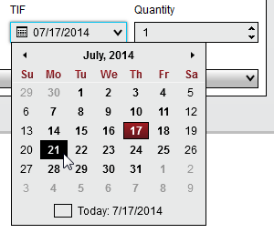


Operations > Order Entry > Trade Controls > TIF Selector
TIF Selector
| << [Click to Display Table of Contents](tif_selector.md) >> **Navigation:**     [Operations](operations.md) > [Order Entry](order_entry.md) > [Trade Controls](trade_controls.md) > TIF Selector | [Previous page](quantity_selector.md) [Return to chapter overview](trade_controls.md) [Next page](basic_entry.md) |
| --- | --- |
The TIF Selector is a standard control available from all order entry features which allows you to set the TIF (Time-In-Force) to be submitted with a custom order.  The selected TIF parameter is sent to your broker on order submission and will instruct how long you would like the order to be active before it is cancelled.
 
| Note:  An order's TIF is not managed by the NinjaTrader application and any cancellations are managed by the brokerage system. |
| --- |

 
## Available TIF Options
The available TIF options are determined by the connection technology of the current selected account.  If a provider's connection technology does not support a certain TIF, it will not be listed to ensure a valid TIF is always been used.  Possible TIF options are described in the table below:
 
| DAY | Orders will remain active until the end of the trading session for the current day |
| --- | --- |
| GTC (Good 'Til Cancelled) | Orders will remain active until explicitly cancelled |
| GTD (Good 'Til Date) | Orders will remain active until the end of trading session on a user defined date |

 
## How to Submit an Order as GTD
When selecting GTD as the TIF for an order, you will be presented with a Date Selector to specify the date you would like the order to be cancelled.
   

 

 
In the image above, the current date is Thursday July, 17th.  If you would like the prepared order to be live until end of session on the following Monday July 21st, you can simply select the 21st from the Date Selector.  
