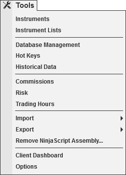


Operations \> Control Center \> Tools Menu
Tools Menu
| \<\< [Click to Display Table of Contents](tools_menu.md) \>\> **Navigation:**     [Operations](operations-1.md) \> [Control Center](control_center-1.md) \> Tools Menu | [Previous page](new_menu-1.md) [Return to chapter overview](control_center-1.md) [Next page](workspaces_menu-1.md) |
| --- | --- |
The following menus and items are available via the Tools menu of the NinjaTrader Control Center.
 

 
| [Instruments](instruments-1.md) | Opens the Instruments window |
| --- | --- |
| [Instrument Lists](instrument_lists-1.md) | Opens the Instrument Lists window |
| [Database Management](database-1.md) | Opens the Database Management window |
| [Hot Keys](hot_key_manager-1.md) | Opens the Hot Keys window |
| [Historical Data](historical_data_manager-1.md) | Opens the Historical Data window |
| [Commissions](understanding_commissions-1.md) | Opens the Commissions window |
| [Risk](understanding_risks-1.md) | Opens the Risk window |
| [Trading Hours](trading_hours-1.md) | Opens the Trading Hours window |
| [Vendor Licensing](licensing_user_authentication-1.md) | Opens the Vendor Licensing window |
| Import | Opens the Import Sub Menu; [Backup File](restoring_a_backup_archive-1.md), [Historical Data](importing-1.md), [NinjaScript Add\-On](import-1.md), [Stock Symbol List](importing_a_list_of_stock_symb-1.md) |
| Export | Opens the Export Sub Menu; [Backup File](creating_a_backup_archive-1.md), [Historical Data](exporting-1.md), [NinjaScript Add\-On](export-1.md) |
| [Remove NinjaScript Assembly](remove-ninjascript-assembly-1.md) | Opens the Remove NinjaScript assembly window |
| [Global Simulation Mode](global_simulation_mode-1.md) | Enables or Disables Global Simulation Mode (Note: Global simulation mode can only be enabled with a live NinjaTrader License) |
| Client Dashboard | Opens the web view of the Client Dashboard |
| [Options](options-1.md) | Opens the Options window |
