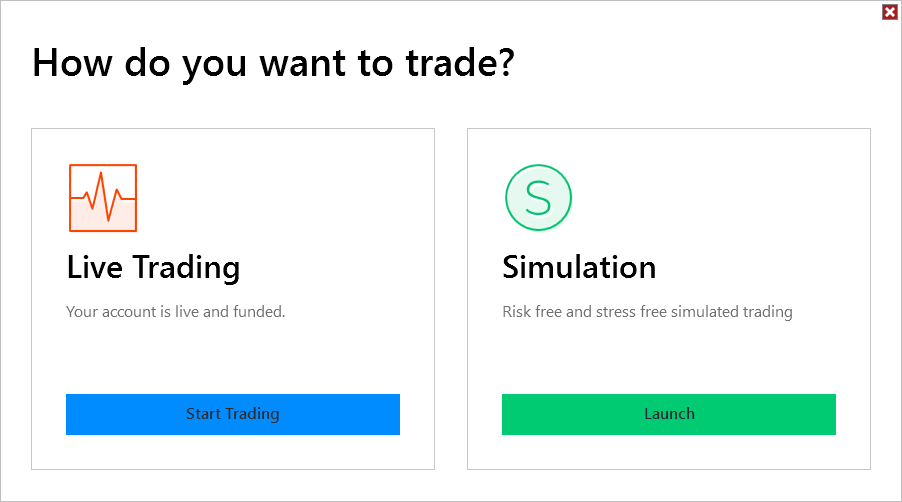

Configuration \> Connecting \> Trading Mode

Trading Mode

| \<\< [Click to Display Table of Contents](trading-mode.md) \>\> **Navigation:**     [Configuration](configuration.md) \> [Connecting](connecting.md) \> Trading Mode | [Previous page](log-in.md) [Return to chapter overview](connecting.md) [Next page](playback_connecting_connection.md) |
| --- | --- |

After Log In you will be presented with the Trading Mode window.

 

 

## Live Trading

The Live Trading section will display the current state of your live account. If your account is live and funded, you can select Start Trading to connect.

 

## Simulation

The Simulation section will display the current start of your simulation account. If your account is active your can select Launch to connect.

 

 

| Note: If Multi\-provider is enabled the Trading Mode screen will be skipped. You can then select what to connect to under the Connections menu of the Control Center. |
| --- |

