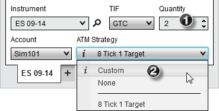
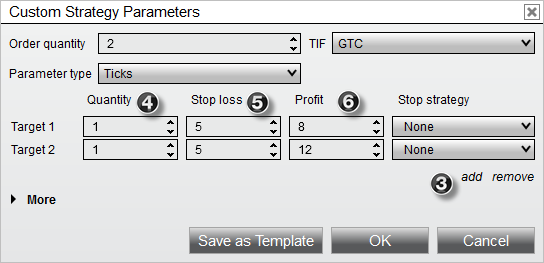
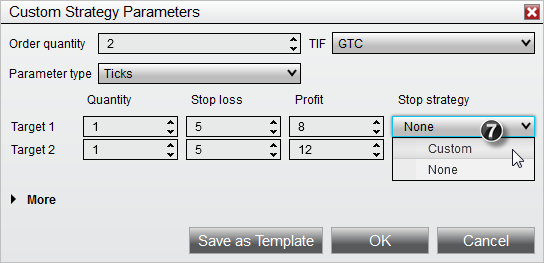
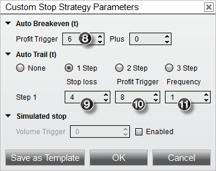
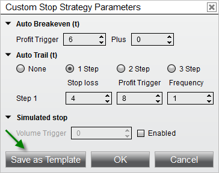
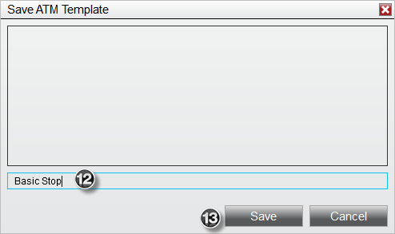
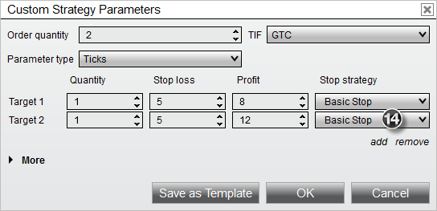
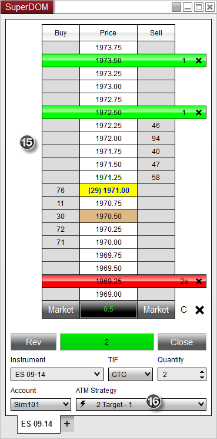


Operations \> Advanced Trade Management (ATM) \> ATM Strategy \> Tutorial: ATM Strategy Example \#2
Tutorial: ATM Strategy Example \#2
| \<\< [Click to Display Table of Contents](tutorial_atm_strategy_example2.md) \>\> **Navigation:**     [Operations](operations.md) \> [Advanced Trade Management (ATM)](advanced_trade_management_atm.md) \> [ATM Strategy](atm_strategy.md) \> Tutorial: ATM Strategy Example \#2 | [Previous page](tutorial_atm_strategy_example_.md) [Return to chapter overview](atm_strategy.md) [Next page](advanced_options.md) |
| --- | --- |
ATM Strategy Example
Following is an example of an ATM Strategy that will automatically submit 2 Stop Loss and Profit Target brackets once the originating entry order is filled. This ATM Strategy includes a Stop Strategy that will automatically adjust the Stop Loss orders using Auto Breakeven and Auto Trail strategies.
 

 
1\. Set the order quantity to 2 contracts
2\. From the ATM Strategy control list select \<Custom\>
 

 
3\. Select "add" once to enable a 2nd target
4\. Set "Quantity" fields to 1 contract each (that represents 1 contract for the first Stop Loss/Profit Target bracket and 1 for the 2nd)
5\. Set the Stop Loss values to 5 ticks (you can set the 2nd Stop Loss to a wider value)
6\. Set the first Profit Target to 8 ticks and the 2nd Profit Target to 12 ticks
 

 
7\. Select \<Custom\> from the Stop Strategy control list under the first target.
 

 
A Stop Strategy parameters dialog window will appear. This is where you will define the automation strategies for automatic Stop Loss adjustment.
 
8\. Set the Auto Breakeven "Profit trigger" value to 6 ticks. This will automatically adjust our Stop Loss order to breakeven once the ATM Strategy has 6 ticks in profit.
9\. Set the Auto Trail "Stop loss" to 4 ticks
10\. Set the Auto Trail "Profit trigger" to 8 ticks
11\. Set the Auto Trail "Frequency" to 1 tick
 
The auto trail parameters will automatically start adjusting our Stop Loss order once we have 8 ticks in profit (9\) to 4 ticks back (10\) and adjust it for every 1 tick (11\) in profit gain.
 

 
You can save the Stop Strategy as a template by clicking the Save as Template button
 

 
12\. Enter the name "Basic Stop"
13\. Press the "Save" button
 
Once you press the Save button, a template is created for this Stop Strategy and it will become available in all Stop Strategy control lists. Press the "OK" button on the Stop Strategy parameters dialog window to exit. 
 

 
14\. Select the Stop Strategy we just created (Basic Stop) in the 1st and 2nd Stop Strategy control lists. This sets the 1st and 2nd Stop Loss orders to the same Stop Strategy so that Stop Loss 1 and Stop Loss 2 will adjust in unison.
 
You can now save this ATM Strategy (Stop Strategies included) as a template by pressing the Save as Template button.
 
Type in the Name "2 Target" and click the "Save" button.  We now have a 2 target strategy template that can be selected from the ATM Strategy control list at any time. Doing so will update all of the parameter fields automatically based on the information we have entered in this example.
 
You can now place an order which once filled will automatically trigger the ATM Strategy to submit the Stop Loss and Profit Target brackets. In the image below, an order was submitted and filled at 1970\.50 as depicted by the brown colored cell.
 

 
15\. The first Profit Target order was submitted at 1972\.50 which is 8 ticks from our entry, the 2nd Profit Target was submitted at 1973\.50 which is 12 ticks from our entry and finally, our 2 Stop Loss orders were submitted at 1969\.25 which is 5 ticks from our entry. You can tell we have 2 orders at the Stop Loss level because the Size Marker has the "s" suffix indicating that we have multiple orders consolidated at the price 1969\.25\.
 
16\. An active ATM Strategy named " 2 Target \- 1" is created and listed under the ATM Strategy control list. The significance of 1 is that this is the only instance of the strategy that has been executed.
 
If under SuperDOM properties you have "ATM Strategy selection mode" set to "SelectActiveATMStrategyOnOrderSubmission", NinjaTrader will automatically set the ATM Strategy control list to the newly created ATM Strategy. The importance of this is if you place another order, any fills resulting from the order will be applied to the existing Stop Loss and Profit Target orders. As an example, if we were filled on an additional contract, our Stop Loss and Profit Target orders would automatically be modified from 1 contract to 2 contracts. Both Stop Loss and Profit Target orders are tied via OCO which means if one of the orders is filled, the other will automatically be cancelled. If the option in the first sentence was not checked, the ATM Strategy control list would be set to the original ATM Strategy template we created. Any subsequent orders would create an additional ATM Strategy that would submit another set of Stop Loss and Profit Target orders.
