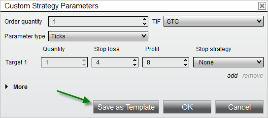
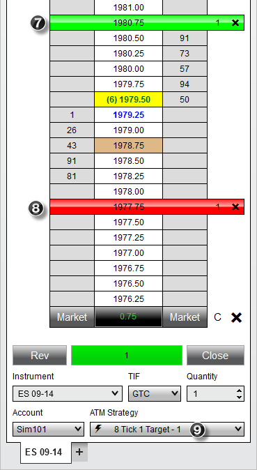


Operations \> Advanced Trade Management (ATM) \> ATM Strategy \> Tutorial: ATM Strategy Example \#1
Tutorial: ATM Strategy Example \#1
| \<\< [Click to Display Table of Contents](tutorial_atm_strategy_example_.md) \>\> **Navigation:**     [Operations](operations.md) \> [Advanced Trade Management (ATM)](advanced_trade_management_atm.md) \> [ATM Strategy](atm_strategy.md) \> Tutorial: ATM Strategy Example \#1 | [Previous page](manage_atm_strategy_templates.md) [Return to chapter overview](atm_strategy.md) [Next page](tutorial_atm_strategy_example2.md) |
| --- | --- |
ATM Strategy Example
Following is an example of how to create a simple 1 stop/1 target ATM Strategy and save the strategy as a template. You can do this via any NinjaTrader order entry window (excluding the [Order Ticket](order_ticket.md) window)
 
| playVideo |
| --- |
|  |

 

 
1\. Set the order quantity to 1 contract
2\. From the ATM Strategy control list select \<Custom\> which will open the Custom Strategy Parameters window
 

 
3\. Set the Stop Loss value to 4 ticks
4\. Set the Profit Target value to 8 ticks
 
This simple ATM Strategy will automatically submit a Stop Loss order 4 ticks from entry and a Profit Target order 8 ticks from entry.
 
You can save this ATM Strategy as a template by clicking the Save as Template button from the Custom Strategy Parameters window
 

 

 
5\. Enter the name "8 Tick 1 Target"
6\. Press the "Save" button
 
Once you press the save button, a template is created for this ATM Strategy, and it will become available in the strategy control list of all order entry windows. You can now place an order which, once filled, will automatically trigger the ATM Strategy to submit the Stop Loss and Profit Target. In the image below, an order was submitted and filled at 1978\.75 as depicted by the brown colored cell.
 

 
7\. A Profit Target was submitted at 1980\.75 which is 8 ticks from our entry price of 1978\.75
8\. A Stop Loss was submitted at 1977\.75 which is 4 ticks from our entry price of 1978\.75
9\. An active strategy named " 8 Tick 1 Target \- 1" is created and listed under the ATM Strategy control list.
   

If under SuperDOM Properties you have the "[ATM Strategy selection mode](atm_strategy_selection_mode.md)" set to "SelectActiveATMStrategyOnOrderSubmission", NinjaTrader will automatically set the ATM Strategy control list to the newly created ATM Strategy. The importance of this is if you place another order, any fills resulting from the order will be applied to the existing Stop Loss and Profit Target orders.  As an example, if we were filled on an additional contract, our Stop Loss and Profit Target would automatically be modified from 1 contract to 2 contracts. Both Stop Loss and Profit Target orders are tied via OCO which means if one of the orders is filled, the other will automatically be cancelled. If the option in the first sentence was not checked, the ATM Strategy control list would be set to the "8 Tick 1 Target" ATM Strategy template we just created. Any subsequent orders would create an additional ATM Strategy that would submit another set of Stop Loss and Profit Target orders.
