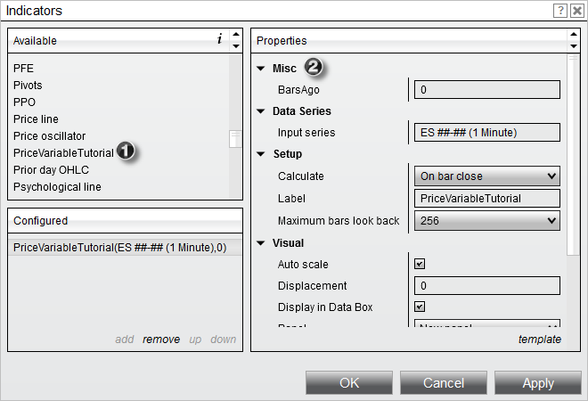

NinjaScript \> Educational Resources \> Developing Indicators \> Beginner \- Using price variables \> Using

Using

| \<\< [Click to Display Table of Contents](using.md) \>\> **Navigation:**     [NinjaScript](ninjascript-1.md) \> [Educational Resources](educational_resources-1.md) \> [Developing Indicators](developing_indicators-1.md) \> [Beginner \- Using price variables](beginner_-_using_price_variabl-1.md) \> Using | [Previous page](compiling-1.md) [Return to chapter overview](beginner_-_using_price_variabl-1.md) [Next page](developing_outside_of_the_ninj-1.md) |
| --- | --- |

Your indicator is now ready for use and will be listed in the Indicator Dialog window.

 

 

1\) The indicator can now be found in the "Available" section of the Indicators window

2\) Once added to the "Configured" section, our user\-defined inputs can be entered along with standard indicator properties.

 

Once applied to a chart, the indicator should look something like the image below.

 

