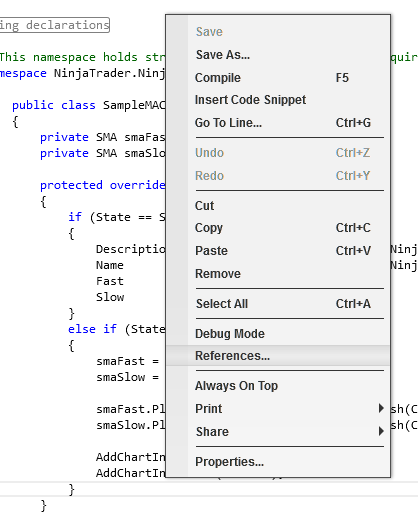
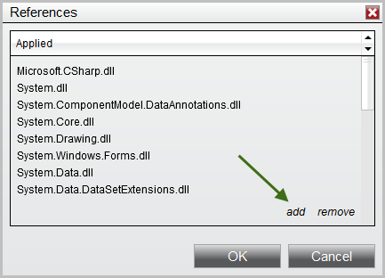


NinjaScript \> Educational Resources \> Using 3rd Party Indicators
Using 3rd Party Indicators
| \<\< [Click to Display Table of Contents](using_3rd_party_indicators.md) \>\> **Navigation:**     [NinjaScript](ninjascript.md) \> [Educational Resources](educational_resources.md) \> Using 3rd Party Indicators | [Previous page](understanding_the_lifecycle_of.md) [Return to chapter overview](educational_resources.md) [Next page](using_atm_strategies.md) |
| --- | --- |
## 3rd Party Indicators Overview
You can use 3rd party indicators within your strategies or custom indicators. A 3rd party indicator is an indicator that was not developed by NinjaTrader. 
 
| Note:  It is important to understand the functionality provided or NOT provided in a 3rd party proprietary indicator. Just because they provide an indicator that displays a bullish or bearish trend on a chart does NOT mean that you can access this trend state from their indicator.   It is up to the developer of the indicator to determine what information is accessible. |
| --- |

 
3rd party indicators can be provided to you in one of the following ways:
 
- NinjaScript archive file that can be directly [imported](import.md) into NinjaTrader  

- A custom installer 

- A set of files and instructions for saving them in the correct folders 

 
If you were provided with a NinjaScript archive file that you have successfully imported via the Control Center window "File \> Utilities \> Import NinjaScript" menu, you can skip over the information below since NinjaTrader automatically configures the indicators ready for use.
 
If you were provided with a custom installer or a compiled assembly (.DLL) file that you had to manually save in the folder My Documents\\NinjaTrader Folder\>\\bin\\Custom then you must follow the instructions below.
 
## Vendor File
The 3rd party developer should have either installed a "Vendor" file or provided you with one. Its likely in the format "NinjaTrader.VendorName.cs" where VendorName is the name of the 3rd party vendor. This file allows you to conveniently access their indicators.
 
- If you were provided an installer, you can check with the vendor if this file was included or; 

- If they provided you this file, save it to "My Documents\\\<NinjaTrader Folder\>\\bin\\Custom" and restart NinjaTrader 

 
## Adding a Reference
1\. From within the NinjaScript Editor, right click on your mouse to bring up the context menu and select the sub\-menu References... as per the image to the right.

 
2\. A References window will appear
 
3\. Press the "add" and select the 3rd party vendor DLL file
 
| Warning: Please make sure in this step to select only the 'true' DLL file needed for reference, which would not contain any X86 or X64 suffixes in its file\-name, otherwise you could run into compile issues later. |
| --- |

 
4\. You will see a reference to the 3rd party vendor DLL in the References window
 
5\. Press the OK button
 
You will now be able to access the indicator methods provided by the 3rd party vendor
 

