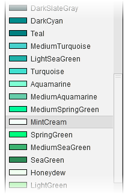
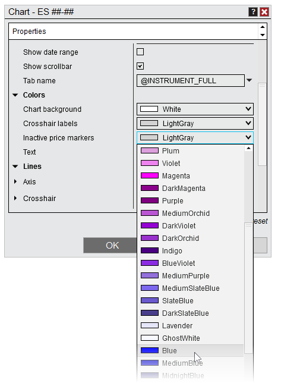
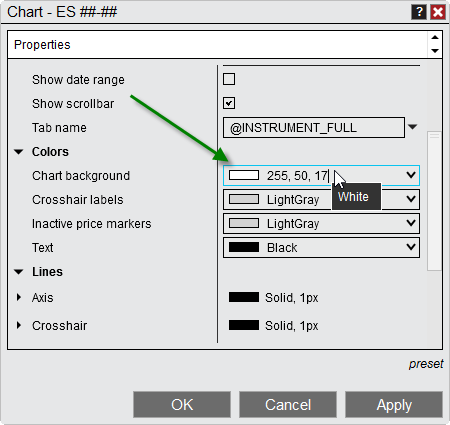


Operations \> Windows \> Using Color Pickers
Using Color Pickers

| \<\< [Click to Display Table of Contents](using_color_pickers.md) \>\> **Navigation:**     [Operations](operations-1.md) \> [Windows](window_tabs-1.md) \> Using Color Pickers | [Previous page](printing_content-1.md) [Return to chapter overview](window_tabs-1.md) [Next page](ninjascript-1.md) |
| --- | --- |

Color Picker
NinjaTrader features a standard Color Picker which can be used to quickly apply a set of predefined colors to any feature that allows for configuration of personalized colors (chart bars, indicator plots, Time \& Sales rows \-\- anything which allows a color to be set). You can also use this tool to add custom color by defining either the underlying Hexadecimal Value, or by using a comma separated Red, Green, Blue (RGB) values.
 

 
Accessing a Color Picker
You will find the Color Picker in various areas of the product, such as a Properties window, or when setting up a new chart. Color pickers function identically to standard drop\-down menus, showing a collection of .NET Brushes, or colors, which can be applied to the feature to which a particular Color Picker relates. Brushes are organized by Hue, and display both the name and a small sample of the Brush color.
 

 
Using Custom Colors
NinjaTrader's Color Pickers allow you to enter custom color values not defined in by default by clicking and typing directly into the field, rather than pulling down the menu. Values can be entered in one of 5 formats:
 
| Method | Brush Type | Description |
| --- | --- | --- |
| Name | Solid Brush | The name of your desired color (e.g., Red, LimeGreen, Khaki) if it already exists in the Color Picker |
| RGB (Red, Green, Blue) Value | Solid Brush | A comma\-separated RGB value (eg. "255, 192, 203" for Pink) |
| ARGB (Alpha, Red, Green, Blue) Value | Transparent Brush | A comma\-separated ARGB value (eg. "50, 255, 192, 203" for Pink with 50% Opacity) |
| Hexadecimal Value (\#RRGGBB) | Solid Brush | A hexadecimal value representing a color (eg. \#6A5ACD for Slate Blue) |
| Hexadecimal Value (\#AARRGGBB) | Transparent Brush | Hexadecimal values can optionally include an Alpha component where 00 is fully transparent and FF is fully opaque (eg., \#806A5ACD)     | Alpha component | Opacity | | --- | --- | | FF | 100% | | E6 | 90% | | CC | 80% | | B3 | 70% | | 99 | 60% | | 80 | 50% | | 66 | 40% | | 4D | 30% | | 33 | 20% | | 1A | 10% | | 00 | 0% | |

 

 
The image above shows an RGB value typed in to produce a White color.
 
| Note: Custom colors typed in manually will only apply to the specific Color Picker in which they are typed, and will not be available after the next startup. However, colors can be added to all Color Pickers permanently by [creating your own skin](creating_your_own_skin-1.md). |
| --- |

