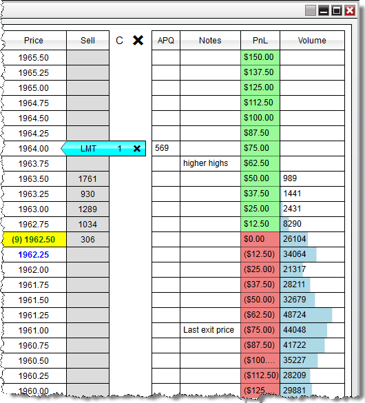



Operations \> Order Entry \> SuperDOM \> Using SuperDOM Columns

Using SuperDOM Columns

| \<\< [Click to Display Table of Contents](using_superdom_columns.md) \>\> **Navigation:**     [Operations](operations.md) \> [Order Entry](order_entry.md) \> [SuperDOM](superdom.md) \> Using SuperDOM Columns | [Previous page](managing_positions_superdom.md) [Return to chapter overview](superdom.md) [Next page](superdom_templates.md) |
| --- | --- |

| playVideo |
| --- |
|  |

## 

In addition to the standard [Price Column](price_ladder_display.md) used to display bid/ask data, the NinjaTrader SuperDOM has the ability to add additional columns for even further analysis for real\-time market prices. NinjaTrader comes with 4 pre\-built system columns (displayed in the image below), with many more which can be downloaded to extend functionality.

 

        [Understanding the Columns window](javascript:HMToggle('toggle','UnderstandingTheColumnsWindow','UnderstandingTheColumnsWindow_ICON'))

| The Columns window is used to add, remove and edit all columns within a SuperDOM    Accessing the Columns Window Right mouse click on the SuperDOM window and select the menu Columns    Sections of the Columns Window The image below displays the three sections of the Columns window: 1\.List of Available columns (a description of the selected column can be viewed by clicking on the info_icon symbol, see the green arrow in the image below)2\.Current columns Configured on the SuperDOM3\.Selected columns Properties  SuperDOM_47 |
| --- |

        [How to add columns](javascript:HMToggle('toggle','HowToAddColumns','HowToAddColumns_ICON'))

| Adding a Column To add an column to a SuperDOM: 1\. Open the Columns window (see the "Understanding the columns window" section above) 2\. Left mouse click on the Available column you want to add and press the Add button or simply double click on it 3\. The column will now be visible in the list of Configured columns 4\. The column's parameters will now be editable on the right side of the columns window (see the "How to edit a column's parameters" section below)   SuperDOM_48 |
| --- |

        [How to edit a column's parameters](javascript:HMToggle('toggle','HowToEditAColumnsParameters','HowToEditAColumnsParameters_ICON'))

| Editing a Column You can customize any column from the Columns window: 1\. Open the columns window (see the "Understanding the columns window" section above) 2\. Highlight the column you would like to edit from the list of applied columns (as shown in the image below). 3\. Once highlighted this column's parameters will be available to edit on the right hand side.    SuperDOM_49   Column Parameters The following parameters are common to most columns:     | Setup |  | | --- | --- | | Label | Sets the text used for the column header | | Visual |  | | Color for background | Sets the color used for the column cells | | Color for foreground | Sets the color used for the column text | | Visible | Enables / Disables if the column should be displayed on the SuperDOM | | Time Frame |  | | Trading Hours | Sets the hours used for historical bar calculations |      Each column will have its own set of parameters specific to that column.  Please see the "Understanding the default systems columns" section below for more information on each of NinjaTrader's pre\-built columns.  For any custom columns that have been downloaded, please refer to the column's developer for more information on settings specific to their custom column. |
| --- | --- | --- | --- | --- | --- | --- | --- | --- | --- | --- | --- | --- | --- | --- | --- | --- |

        [Understanding the APQ (Approximate Position in Queue) Column](javascript:HMToggle('toggle','UnderstandingTheAPQApproximatePositionInQueueColumn','UnderstandingTheAPQApproximatePositionInQueueColumn_ICON'))

| APQ (Approximate Position in Queue) Column The APQ column will calculate the number of contract resting ahead of your Limit orders based on the number of contracts that were advertised at the time the order was submitted, in other words \- it will give you the worst possible position in the queue for your order \- so you know conservatively how many contracts need to be filled before it's your orders turn.   SuperDOM_50   1\.  Let's say you place a Buy limit order at a price of 1963\.50, and at the time the order was confirmed as working from the exchange, there were 1233 contracts working at this level ahead of you.   2\. APQ will assume that your order has a queue position of 1234, and will continue to monitor the number of contracts that are advertised at this level, and give you the number of contracts that are remaining based off the volume updates that occur at that price level.     | Notes: •The value displayed in the APQ is a calculation based on the level II volume from your data provider.  For simulated orders, there is no way to accurately track your order against the live orders that are being sent from the data provider and filled at a live exchange, and as a result, the estimate will have little to no value to your simulation orders.  An order placed on a live account would be more accurately reflected, however it should be noted that this calculation is a client side calculated theoretical value.•Stop orders do not have an APQ as it has no queue effect. A stop order will trigger once the market trades at the stop price. | | --- | |
| --- | --- |

        [Understanding the Notes Column](javascript:HMToggle('toggle','UnderstandingTheNotesColumn','UnderstandingTheNotesColumn_ICON'))

| Notes Columns The Notes column will give you the ability to record custom user\-defined text at any price row on the SuperDOM.  This will allow you to monitor and track individual price levels with any text you may find useful.     To record a note: 1\.Double click on the corresponding price row in the Notes column to enter the text\-edit mode2\.Using your keyboard, type in the text you wish to display3\.Press Enter on your Keyboard accept the text.  SuperDOM_51   Your custom note will now be synchronized with the price corresponding price row and will remain at that price level as your scroll up or down on the SuperDOM.   To remove a note, simply double click on the note row to re\-enter the text\-edit mode which will allow you to erase the text using your backspace or delete key on your keyboard. |
| --- |

        [Understanding the Pulling/Stacking Column](javascript:HMToggle('toggle','UnderstandingthePullingStackingColumn','UnderstandingthePullingStackingColumn_ICON'))

| Pulling/Stacking Columns The Pulling/Stack column is a customizable display that indicates the changes in the market depth based on user settings or if a reset notification is received on the SuperDOM.   SuperDOM_59   Example: In the screenshot above the sell depth at 4520\.75 was initially at 91, but dropped to 84 resulting in a display of \-7\.   Column Properties   | Display | Sets the ability to display values for Ask, Bid, or Ask \& Bid | | --- | --- | | Reset when | Bid/Ask change: It will start tracking changes as soon as a price starts receiving real\-time depth data and continue to accumulate the changes so long as the associated bid/ask price is consistent. If the associated bid/ask price moves, the values reset. It will only track values within the “\# of market depth levels”. No longer receiving depth data: It will start tracking changes as soon as a price starts receiving real\-time depth data and continue to accumulate the changes so long as real\-time depth data is being received at that price level. If the price then moves and there is no longer depth data at that price level since it is outside of the “\# of market depth levels”, it would then reset. | | Reset Tolerance | This is a conditional item for Reset When so that if the change occurs, but returns back within the specified milliseconds, it will not rest. | |
| --- | --- | --- | --- | --- | --- | --- |

        [Understanding the Recent Bid/Ask Column](javascript:HMToggle('toggle','UnderstandingtheRecentBidAskColumn','UnderstandingtheRecentBidAskColumn_ICON'))

| Recent Bid/Ask Columns The Recent Bid/Ask column is a customizable display that indicates the recent volume that occurred at the bid or ask prices on the SuperDOM.   SuperDOM_61   Example:  in the above screenshot we can see a volume of 1 occurred at the bid price and a volume of 4 occurred at the ask.   Column Properties   | Display | Sets the ability to display values for Ask, Bid, or Ask \& Bid | | --- | --- | | Reset when | Price returns: The accumulated volume will stay displayed until the associated bid/ask price leaves the price then later returns to that price level.  Bid/Ask change: The accumulated volume will stay displayed so long as the bid/ask price stays the same. When the bid/ask price change, the value will reset. | | Reset Tolerance | This is a conditional item for Reset When so that if the change occurs, but returns back within the specified milliseconds, it will not rest. | |
| --- | --- | --- | --- | --- | --- | --- |

        [Understanding the PnL Column](javascript:HMToggle('toggle','UnderstandingThePnLColumn','UnderstandingThePnLColumn_ICON'))

| PnL Column The PnL column will display the amount of Profit or Loss for each price row based on your average entry price.  This column has a setup property to display the number of units in Currency, Percent, Pips, Points, or Ticks (please see "How to edit a column's parameters" section above)   Once there is a position opened on the selected instrument, the PnL column will then calculate what you can expect your PnL to be at each price row on the SuperDOM based on the current position size, entry price and the tick size / point value of the instrument that is being traded.   SuperDOM_52 |
| --- |

        [Understanding the Volume Column](javascript:HMToggle('toggle','UnderstandingTheVolumeColumn','UnderstandingTheVolumeColumn_ICON'))

| Volume Column The Volume Column will display the number of contracts that have traded in the current session.  This column has two Setup Properties to determine how the volume information is displayed. You data feed provider must support historical tick data and is using the Volume Column in Buy/Sell mode must also support Historical Bid/Ask tick data.      | Note: The SuperDOM Volume Column will reset as the first tick of the next session comes in. If you open a fresh SuperDOM Volume Column outside of the instruments trading hours you will not see any Volume until the next sessions opening tick. | | --- |        | Display value in |  | | --- | --- | | Volume | Displays the actual number of contracts executed at each price level | | Percent | Displays a value percentage based off of the total number of contracts traded in the session | | Type |  | | 1\. Standard | Trades are represented as the cumulative number of contracts that have been executed at each price level | | 2\. BuySell | Trades are categorized as a buy (at the ask or above) or as a sell (at the bid or below) and then color coded based on the color parameters used in the Visual section (see "How to edit a column's parameters" section above |      | SuperDOM_54 |  | SuperDOM_53 | | --- | --- | --- | |
| --- | --- | --- | --- | --- | --- | --- | --- | --- | --- | --- | --- | --- | --- | --- | --- | --- |

        [How to remove columns](javascript:HMToggle('toggle','HowToRemoveColumns','HowToRemoveColumns_ICON'))

| Removing a Column To remove a column from your NinjaTrader SuperDOM:   •Open the Columns window (see the "Understanding the Columns window" section above), select a column from the Configured columns list, press the Remove button, and then press the OK button to exit the Columns window. |
| --- |

        [Customize the display of columns](javascript:HMToggle('toggle','CustomizeTheDisplayOfColumns','CustomizeTheDisplayOfColumns_ICON'))

| Moving/Resizing Columns Each column added to the SuperDOM can be individually resized or moved.   To move the order of columns in the SuperDOM window   •Right click on the SuperDOM and select Columns. •From the Columns window you can use "up" or "down" in the Configured columns section.•Left mouse click "up" to move the selected applied column left in the SuperDOM window•Left mouse click "down" to move the selected applied column right in the SuperDOM window   SuperDOM_55   To resize the width of a column:   •Move your cursor to the edge of the column you wish to resize, where your cursor will turn into a left and right facing arrow•Left mouse click and drag to meet the width you desire  SuperDOM_56   Trade Control On Left By default, the Trade Control will be displayed on the bottom of the SuperDOM.  However you can optionally set the Trade Control to be displayed on the left of the SuperDOM Price Ladder for a more compacted view which has been optimized for using multiple columns on the SuperDOM.  To enable this display, simply right click on the SuperDOM window and select the Trade Control On Left menu item.   SuperDOM_57 |
| --- |

        [Custom column development](javascript:HMToggle('toggle','CustomColumnDevelopment','CustomColumnDevelopment_ICON'))

| In addition to the 4 system columns that come pre\-built with the NinjaTrader application, you also have the ability to create custom columns of your own.  For example, you could create your own custom volume column to apply to your NinjaTrader SuperDOMs.   For more information on using NinjaScript to build custom SuperDOM Columns please see the NinjaScript section of the user help guide.    The option to hire a [https://ninjatraderecosystem.com/search\-results/?fwp\_category\=programming\-services](https://ninjatraderecosystem.com/search-results/?fwp_category=programming-services) to build your custom indicators is also available. |
| --- |

