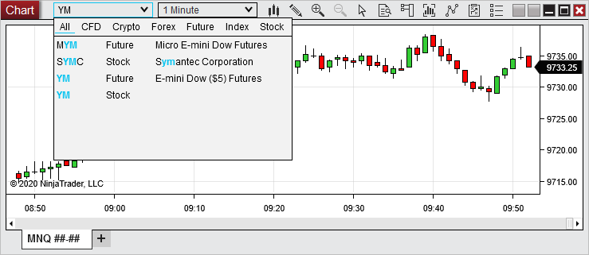
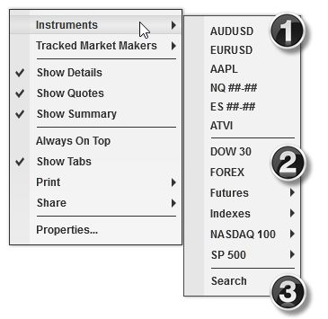
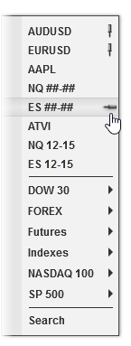


Operations > Windows > Using the Instrument Selector
Using the Instrument Selector

| << [Click to Display Table of Contents](usingtheinstrumentselector.md) >> **Navigation:**     [Operations](operations.md) > [Windows](window_tabs.md) > Using the Instrument Selector | [Previous page](linking_windows.md) [Return to chapter overview](window_tabs.md) [Next page](instrument_overlay_selector.md) |
| --- | --- |

## Instrument Selector
## All order-entry and market-data windows feature an Instrument Selector, which can be used to quickly select the desired instrument.
## This can be accessed either from the Instrument Selector directly on the window or in the right-click menu.
 
## Using the Quick Search
To access the Quick Search,start typing directly into the Instrument Selector.
The Quick Search will appear and can be used to filter results by instrument type if desired. Last used filter settings are retained. Typing @, ^, or $ will automatically set the filter to the associated instrument type.
Double clicking the instrument from the results will load that instrument. When selecting a futures instrument, it will load the current expiry. Typing in the desired instrument and pressing Enter will load the entered instrument (including the desired expiry for futures).
 
| Note: When entering a desired expiry or exchange, no quick search results will appear since it no longer matches the search items. Pressing Enter will still load the desired instrument. |
| --- |

## 

## 
## Accessing the Instruments Menu
To access the Instruments menu, click the down arrow on the Instrument Selector or right mouse click in the window in which you wish to apply a new instrument then hover your mouse cursor over the Instruments menu item. 
 

 
The Instruments menu is separated into three sections:
 
1) Pinned or recently viewed instruments
 
2) Instrument Lists
 
3) Search feature
 
To access any instrument in the top section, simply left mouse click the instrument name, and it will be applied in the specific window in which you are working. To access an instrument in an instrument list, first hover your mouse cursor over one of the lists displayed (all instrument lists will be displayed), and a list of instruments contained within will appear. You can then left mouse click on any instrument in the list to apply it in the window. 
 
If you do not see your desired instrument listed, click the Search menu item to access the Instruments window, in which you can search your entire database of instruments. Use the "Search" dropdown menu near the top of the window to filter results by instrument type, such as stocks or futures, then enter search terms in the text field directly beside it, and the search results will appear as you type. Once you have located your desired instrument, select it in the list of search results, then click OK to close the window and apply the instrument. Once you have applied an instrument this way, it will then be saved in the list of recently viewed instruments, and can be pinned from there.
 
## Pinning and Removing Instruments to the Instruments Menu
To pin an instrument in the Instruments menu, first view that instrument in any window, in order to add it to the list of recently viewed instruments. Once it is in the list, open the Instruments menu in any window, hover your mouse cursor over the instrument you wish to pin, then left mouse click the small icon resembling a push-pin laying horizontally that appears next the instrument name. Pinned instruments will display a vertically standing push-pin icon next to their names.
 

 
To remove any item from the list of pinned and recently viewed instruments, first hover your mouse cursor over the instrument you wish to remove, then click the Delete key on your keyboard.
