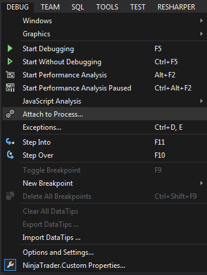
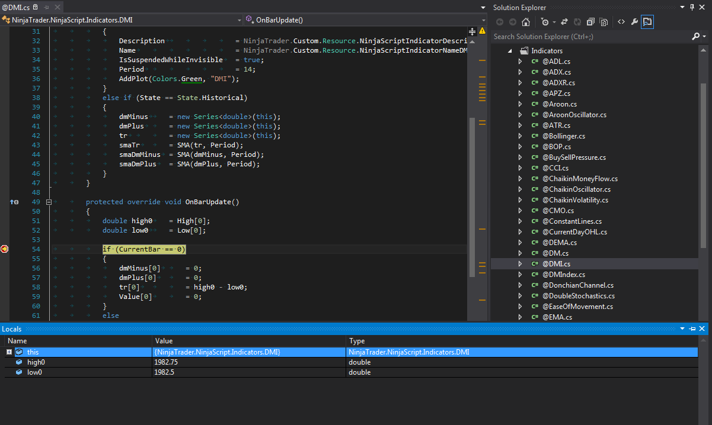



NinjaScript \> Editor \> Visual Studio Debugging

Visual Studio Debugging

| \<\< [Click to Display Table of Contents](visual_studio_debugging.md) \>\> **Navigation:**     [NinjaScript](ninjascript-1.md) \> [Editor](editor-1.md) \> Visual Studio Debugging | [Previous page](output-1.md) [Return to chapter overview](editor-1.md) [Next page](editor_keyboard_shortcuts-1.md) |
| --- | --- |

You can debug your NinjaScript objects using Microsoft Visual Studio. NinjaScript objects are compiled into a single DLL, named "NinjaTrader.Custom.dll." When debugging, a special debug DLL is created for temporary use, with the same name as the release version. 

 

| Notes:  •Using the debug DLL can incur a runtime performance impact, so it is recommended to disable Visual Studio debugging and re\-compile your scripts when finished. This will replace the debug DLL with the release version.•The Visual Studio button will work with Visual Studio 2019 or 2022 \- if multiple versions are installed, it will start the highest one. |
| --- |

 

## Using Visual Studio Debugging

1\. In the NinjaScript Editor, enable "Debug Mode" via the right\-click menu, as seen in the image below. After this, compile your scripts to create the debug DLL.

 

 

2\. From the NinjaScript Editor, click on the Visual Studio icon  from the tool bar, which will automatically load the NinjaTrader.Custom project with your installed version of Visual Studio.

 

3\. In Visual Studio, select Debug, then select Attach to Process

 

 

4\. Select NinjaTrader from the list of processes, then select Attach. Be sure the "Attach to" field is set to "Automatic: Managed code" or "Managed code".

 

 

4\. Open the NinjaScript source file within Microsoft Visual Studio and set your break point(s)

 

 

5\. Run your NinjaScript object in NinjaTrader and it should stop at your break points and all the debugging tools and information should be available to inspect the current state of the code.

 

| Tip:  You can also use Visual Studio as editor for your NinjaScript files \- for that open the project as in step 2 above and then use Visual Studio for editing and once done save the file (don't run or build the solution then in Visual Studio), preferably with the NinjaScript editor opened still at the same time, so changes would be auto compiled in then. |
| --- |

