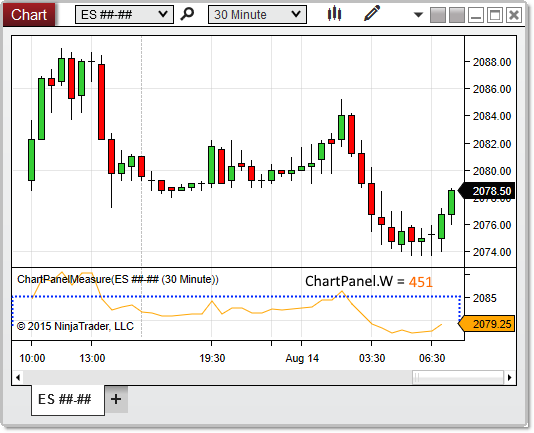


NinjaScript > Language Reference > Common > Charts > ChartPanel > W (Width)
W (Width)

| << [Click to Display Table of Contents](w_width_chartpanel.md) >> **Navigation:**     [NinjaScript](ninjascript-1.md) > [Language Reference](language_reference_wip-1.md) > [Common](common-1.md) > [Charts](chart-1.md) > [ChartPanel](chartpanel-1.md) > W (Width) | [Previous page](chartscale_chartpanel-1.md) [Return to chapter overview](chartpanel-1.md) [Next page](x_coordinate_chartpanel-1.md) |
| --- | --- |

## Definition
Indicates the width (in pixels) of the paintable area of the chart panel. 
 
| Note: The paintable area does not extend all the way to the right edge of the panel itself, as seen in the image below. |
| --- |

## Property Value
A int representing the width of the panel in pixels
 
## Syntax
ChartPanel.W
## 
## Example
| ns |
| --- |
| protected override void OnRender(ChartControl chartControl, ChartScale chartScale) {    base.OnRender(chartControl, chartScale);         // Print the width of the panel    Print(ChartPanel.W); } |

Based on the image below, W reveals that the chart panel is 451 pixels wide.
 

