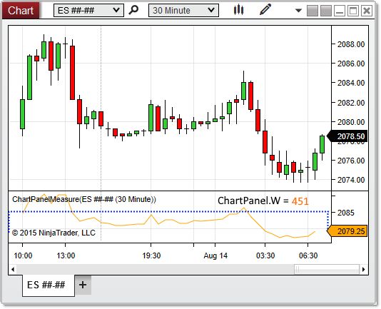



W (Width)

|  |  |
| --- | --- |
| << [Click to Display Table of Contents](w_width_chartpanel.htm) >>  **Navigation:**  [NinjaScript](ninjascript.htm) > [Language Reference](language_reference_wip.htm) > [Common](common.htm) > [Charts](chart.htm) > [ChartPanel](chartpanel.htm) >  W (Width) | [Previous page](chartscale_chartpanel.htm) [Return to chapter overview](chartpanel.htm) [Next page](x_coordinate_chartpanel.htm) |

Definition
----------

Indicates the width (in pixels) of the paintable area of the chart panel.

|  |
| --- |
| Note: The paintable area does not extend all the way to the right edge of the panel itself, as seen in the image below. |

Property Value
--------------

A int representing the width of the panel in pixels

Syntax
------

ChartPanel.W

Example
-------

| ns |
| --- |
| protected override void OnRender(ChartControl chartControl, ChartScale chartScale)  {     base.OnRender(chartControl, chartScale);           // Print the width of the panel     Print(ChartPanel.W);  } |

 

 

Based on the image below, W reveals that the chart panel is 451 pixels wide.

 

