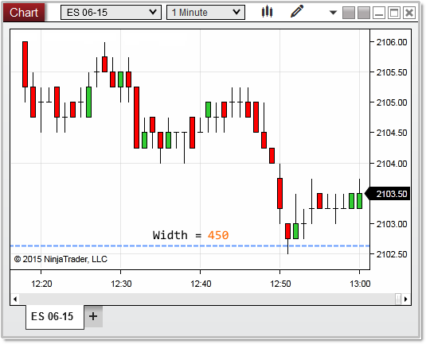

NinjaScript \> Language Reference \> Common \> Charts \> ChartScale \> Width

Width

| \<\< [Click to Display Table of Contents](width.md) \>\> **Navigation:**     [NinjaScript](ninjascript-1.md) \> [Language Reference](language_reference_wip-1.md) \> [Common](common-1.md) \> [Charts](chart-1.md) \> [ChartScale](chartscale-1.md) \> Width | [Previous page](chartscale_scalejustification-1.md) [Return to chapter overview](chartscale-1.md) [Next page](rendering-1.md) |
| --- | --- |

## Definition

Indicates the overall distance (from left to right) of the chart scale.

 

| Note: Width does not return its value in terms of device pixels. However, using Width.ConvertToVerticalPixels or Width.ConvertToHorizontalPixels will convert the Width value to device pixels. Alternatively, RenderTarget.PixelSize.Width or ChartPanel.W will also provide the width in terms of device pixels. |
| --- |

## 

## Property Value

A double value representing the width of the chart scale.

## 

## Syntax

\<chartScale\>.Width

 

## Examples

| ns |
| --- |
| protected override void OnRender(ChartControl chartControl, ChartScale chartScale) {    // the width of the entire chart scale    double   width       \= chartScale.Width;    Print("the width of the chart scale is: " \+ Width);   } |

 

 

In the image below, the entire of width of the chart scale is represented by the blue line which is calculated at 450 pixels.

 

