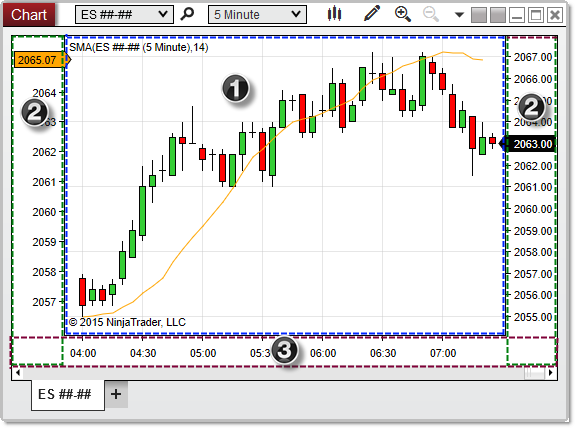


NinjaScript > Educational Resources > Working with Chart Object Coordinates
Working with Chart Object Coordinates

| << [Click to Display Table of Contents](working_with_chart_object_coordinates.md) >> **Navigation:**     [NinjaScript](ninjascript-1.md) > [Educational Resources](educational_resources-1.md) > Working with Chart Object Coordinates | [Previous page](working_with_brushes-1.md) [Return to chapter overview](educational_resources-1.md) [Next page](working_with_pixel_coordinates-1.md) |
| --- | --- |

## Understanding Chart Canvas Coordinates
The chart canvas represents the portion of a chart window on which objects can be painted (the area outlined in blue in the image below). The canvas area is measured by an x-axis and y-axis independent of the price and time-axis of the chart itself. When working with coordinates on a chart canvas, it is important to note that the origin point (coordinates 0,0) is in the top-left corner of the canvas, NOT the bottom-left. Moving down the canvas increases the y-coordinate, and moving the the right on the canvas increases the x-coordinate.
## 
## ChartControl_XY
## 
## 
## Understanding Chart Areas
When using ChartControl properties and methods, it is important to understand the layout of a chart window, and which specific area of the window is being measured by a specific property. The image below shows the three primary areas of a chart window.
 

 
The three regions shaded in the image above are labeled as follows:
 
1. The chart canvas covers the area in which bars, drawing objects, and indicator plots can be painted. It is bounded on the bottom by the x-axis, and on the right, left, or both by the y-axis. This is measured by properties such as [CanvasLeft](canvasleft-1.md) and [CanvasRight](canvasright-1.md).
2. The y-axis extends vertically from the chart's horizontal scroll bar to the top of the chart canvas, and can be displayed to the right or left (or both) of the canvas area, depending the "Scale Justification" properties of the [Bars](bars-1.md) object or indicators painted on the chart. This is measured by properties such as [AxisYLeftWidth](axisyleftwidth-1.md) and [AxisYRightWidth](axisyrightwidth-1.md).
3. The x-axis sits beneath the chart canvas, and extends horizontally from the left edge of the chart canvas (or the left edge of the y-axis if it is visible on the left) to the right edge of the y-axis applied to the right of the canvas (or the right edge of the canvas itself if the y-axis is not visible on the right). This is measured by properties such as [AxisXHeight](axisxheight-1.md).
