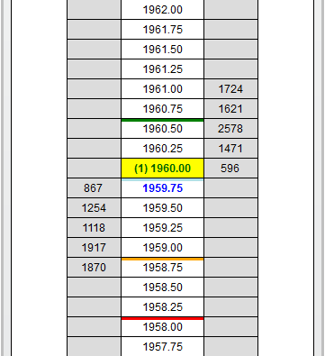



Operations \> Order Entry \> SuperDOM \> Working with Indicators

Working with Indicators

| \<\< [Click to Display Table of Contents](working_with_indicators_superdom.md) \>\> **Navigation:**     [Operations](operations-1.md) \> [Order Entry](order_entry-1.md) \> [SuperDOM](superdom-1.md) \> Working with Indicators | [Previous page](superdom_templates-1.md) [Return to chapter overview](superdom-1.md) [Next page](properties_superdom-1.md) |
| --- | --- |

[Show/Hide Hidden Text](javascript:HMToggleExpandAll(!HMAnyToggleOpen()) "Click to open/close expanding sections")

| playVideo |
| --- |
|  |

## 

 

The SuperDOM's [Price Ladder display](price_ladder_display-1.md) has the ability to add any number of price action indicators which can be used to visualize and analyze indicator values in relation to the SuperDOM display, as well as attaching working orders to the indicator price level for a hand\-free trade management system.

 

 

NinjaTrader comes with over 30 pre\-built indicators which can be added the SuperDOM. Indicators can be added, removed and edited via the Indicators window.

        [Understanding the Indicators window](javascript:HMToggle('toggle','UnderstandingTheIndicatorsWindow','UnderstandingTheIndicatorsWindow_ICON'))

| The Indicators window is used to add, remove and edit all indicators within a SuperDOM. Accessing the Indicators Window •Right mouse click in the SuperDOM select the menu Indicators Sections of the Indicators Window The image below displays the three sections of the Indicators window.   1\.List of Available indicators (a description of the selected indicator can be viewed by clicking on the info_icon symbol, see the green arrow in the image below)2\.Current indicators Configured on the SuperDOM3\.Selected indicator's Properties  SuperDOM_36 |
| --- |

        [How to add an indicator](javascript:HMToggle('toggle','HowToAddAnIndicator','HowToAddAnIndicator_ICON'))

| Adding an Indicator To add an indicator to a SuperDOM: 1\.Open the Indicators window (see the "Understanding the Indicators window" section above)  2\.Left mouse click on the Available indicator you want to add and press the Add button or simply double click on it3\.The indicator will now be visible in the list of Configured indicators4\.The indicator's parameters will now be editable on the right side of the Indicators window (see the "How to edit an indicator" section below)  SuperDOM_37 |
| --- |

        [How to edit an indicator's](javascript:HMToggle('toggle','HowToEditAnIndicators','HowToEditAnIndicators_ICON')) parameters

| Editing an Indicator You can customize any indicator from the Indicators window: 1\.Open the Indicators window (see the "Understanding the Indicators window" section above)2\.Highlight the indicator you would like to edit from the list of applied indicators (as shown in the image below).3\.Once highlighted this indicator's parameters will be available to edit on the right hand side. SuperDOM_38 Indicator Parameters The following parameters are common to all indicators:     | Data Series |  | | --- | --- | | Input Series | Please see the Input series section for further information. | | Price based on | Sets the type of market data used to drive the Data Series. (Last, Ask, Bid) | | Type | Sets the bar type of the Data Series. (See the [Bar Types](bars_type-1.md) section of the Help Guide for more information) | | Value | Sets the Data Series value. | | Time frame |  | | Load data based on | Determines how much data is loaded based on number of bars, number of days, or a custom date range. | | Bars to load | Sets the number of bars or days to load data. | | End date | Sets the end date of the data used in indicator's calculation | | Trading hours | Sets the Trading hours used for the Data Series. (See the [Trading Hours](sessioniterator-1.md) section of the Help Guide for more information) | | Break at EOD | Enables or disables the bars being reset at EOD (End Of Day). (See the "[Understanding Historical Data](data_by_provider-1.md)" section of the Help Guide for more information) | | Set up |  | | Calculate | Sets the frequency that the indicator calculates. On bar close will slow down the calculation until the close of a bar; On price change will calculate on when there has been a change in price; On each tick calculate the indicator's value which each incoming tick. | | Maximum bars look back | Max number of bars used for calculating an indicator's value.  The TwoHundredFiftySix setting is the most memory friendly. | | Visual |  | | Visible | Sets if the indicator plot is visualized on the display | | Plots (...) | Allows you to customize the appearance of the indicator by changing the Color or Thickness |      Saving an Indicator's Parameters as Default You can optionally save your customized indicator's parameters as a default preset. Doing so will recall your customized settings the next time you add this specific indicator to a SuperDOM.   Once you have your indictor's properties set to your preference, you can left mouse click on the "preset" text located in the bottom right of the properties dialog. Selecting the option "save" will save these settings as the default settings used every time you open a new window/tab.   If you change your settings and later wish to go back to the original settings, you can left mouse click on the "preset" text and select the option to "restore" to return to the original settings. |
| --- | --- | --- | --- | --- | --- | --- | --- | --- | --- | --- | --- | --- | --- | --- | --- | --- | --- | --- | --- | --- | --- | --- | --- | --- | --- | --- | --- | --- | --- | --- | --- | --- | --- | --- |
| Indicator Input Series  The indicator Input Series window allows you to select the input series for your indicator's calculations.  This allows you to configure different data types, such as the High, or Open price, or even calculate your indicators based off of multiple nested indicators.     To access this window, move your mouse over the Input Series field, which will change to an "Edit input..." button.   1\.  You can then select the Close, High, Low, Median, Open, Typical, or Weighted value of any Data Series within a SuperDOM.   2\.  Additionally, you can also choose another indicator as the input series.  When you select another indicator as the input series, you can define the properties used in the input series for the second indicator. Once you have selected the input series of your choice left mouse click the OK button to exit the Input Series window.   SuperDOM_39 |

        [Understanding how indicators are displayed](javascript:HMToggle('toggle','UnderstandingHowIndicatorsAreDisplayed','UnderstandingHowIndicatorsAreDisplayed_ICON'))

| Indicator Display Once an indicator has been configured and applied to the SuperDOM, the indicator plot will be displayed in the Price column above the corresponding price row.   SuperDOM_45   In the image above, you can see an orange highlighted price row at 1959\.75, rounded to nearest price from the calculated EMA indicator (1959\.63\).  Hovering your mouse cursor over the indicator plot will display a tool tip which will give you details pertaining to input settings of the indicator.     | Note: It is possible for indicators to be calculated out of range of the current Price Ladder Display.  You can right click on the SuperDOM and uncheck Auto Center which will allow you to scroll up or down on the Price Ladder Display to locate the indicator that has been added. | | --- | |
| --- | --- |

        [How to remove an indicator](javascript:HMToggle('toggle','HowToRemoveAnIndicator','HowToRemoveAnIndicator_ICON'))

| Removing an Indicator To remove an indicator from your NinjaTrader SuperDOM:   •Open the Indicators window (see the "Understanding the Indicators window" section above), select an indicator from the Configured indicators list, press the Remove button, and then press the OK button to exit the Indicators window. |
| --- |

        [Custom indicator development](javascript:HMToggle('toggle','CustomIndicatorDevelopment','CustomIndicatorDevelopment_ICON'))

| In addition to the over 30 price action indicators that come pre\-built with the NinjaTrader application, you also have the ability to create custom indicators of your own.  For example, you could create your own custom multi\-series indicators to apply to your NinjaTrader SuperDOMs.      | Note:  In order for a custom indicator to show up in the list of available SuperDOM Indicators, you must set the [IsOverlay](isoverlay-1.md) property to true in the indicator's State.SetDefaults. | | --- |        For more information on using NinjaScript to build custom indicators please see the [NinjaScript section](ninjascript-1.md) of the user help guide. Click [here](indicator-1.md) to view NinjaScript tutorials.   The option to hire a [NinjaScript Consultant](https://ninjatraderecosystem.com/search-results/?fwp_category=programming-services) to build your custom indicators is also available. |
| --- | --- |

