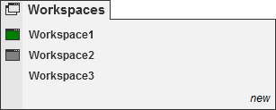



Operations \> Control Center \> Workspaces Menu

Workspaces Menu

| \<\< [Click to Display Table of Contents](workspaces_menu.md) \>\> **Navigation:**     [Operations](operations.md) \> [Control Center](control_center.md) \> Workspaces Menu | [Previous page](tools_menu.md) [Return to chapter overview](control_center.md) [Next page](connections_menu.md) |
| --- | --- |

The following menus and items are available via the Workspaces menu of the NinjaTrader Control Center.

 

 

•A workspace named "Untitled1" will load automatically

•You can have multiple workspaces open simultaneously 

•Open workspaces are indicated by the rectangle icon, if there is no icon then the workspace is closed

•The currently active workspace has a filled green rectangle. You can only have one active workspace

•You can toggle the currently displayed workspace by selecting the workspace you wish to display from the Workspaces menu or using the [Hot Key](hot_key_manager.md) SHIFT \+ F3

•On application shut down you will be given the opportunity to save changes in all open workspaces 

| Create a Workspace ControlCenter_WorkspacesNew   1\.From the NinjaTrader Control Center select the menu Workspaces 2\.Select "new"3\.You will be prompted to type in a name for the new workspace. 4\.On "OK" you will be switched to the new workspace. |
| --- |

        [Saving a workspace](javascript:HMToggle('toggle','SavingAWorkspace','SavingAWorkspace_ICON'))

| Save a Workspace ControlCenter_WorkspacesSave   1\.From the NinjaTrader Control Center select the menu Workspaces 2\.Move your mouse over the name of the workspace you want to save.3\.Select "save"4\.Any changes made to the currently displayed workspace will be saved   Save a Workspace to a New Workspace File ControlCenter_WorkspacesSaveAs 1\.From the NinjaTrader Control Center select the menu Workspaces 2\.Move your mouse over the name of the workspace you want to save to a new workspace file3\.Select save as4\.You will be prompted to type in a name for the new workspace file. 5\.On "OK" you will be switched to the new workspace, the old workspace will persist with no changes and the workspace will be saved to the new Workspace file |
| --- |

        [Opening a workspace](javascript:HMToggle('toggle','OpeningAWorkspace','OpeningAWorkspace_ICON'))

| Open a Workspace ControlCenter_WorkspacesOpen   1\.From the NinjaTrader Control Center select the menu Workspaces 2\.Move your mouse over the workspace that you would like to open and left mouse click. In the screenshot above "Workspace3" is closed and clicking on "Workspace3" will open it and make it the active currently displayed workspace. |
| --- |

        [Closing a workspace](javascript:HMToggle('toggle','ClosingAWorkspace','ClosingAWorkspace_ICON'))

| Close a Workspace ControlCenter_WorkspacesClose   1\.From the NinjaTrader Control Center select the menu Workspaces 2\.Move your mouse over the workspace you would like to close3\.Select "close". The selected workspace will be closed and can be reopened at any time.   At least one workspace must remain open, if you close the last workspace a temporary workspace will be created. |
| --- |

        [Removing a workspace](javascript:HMToggle('toggle','RemovingAWorkspace','RemovingAWorkspace_ICON'))

| ControlCenter_WorkspacesRemove   Remove a Workspace 1\.From the NinjaTrader Control Center select the menu Workspaces 2\.Move your mouse over the workspace you would like to remove3\.Select "remove". You will get a dialog asking you to confirm the delete as any remove operation cannot be undone    | Note: Removing a workspace will also remove previous versions from the restore utility. However, it will not remove it from backups | | --- | |
| --- | --- |

        [How to quickly switch between workspaces](javascript:HMToggle('toggle','HowToQuicklySwitchBetweenWorkspaces','HowToQuicklySwitchBetweenWorkspaces_ICON'))

| Quickly Switching Between Workspaces Pressing SHIFT\+F3 keys together will cycle to the next open workspace. |
| --- |

        [How to recover workspaces](javascript:HMToggle('toggle','HowtorecoverWorkspaces','HowtorecoverWorkspaces_ICON'))

| Restore a Prior Version of Workspaces If you need to restore a previously saved version of a saved workpspace, you can do this within the Control Center by going to Tools and selecting Database Management. In here you will see a Restore Workspace section to complete the recovery. See the [Database Operations](database_operations.md) section.   By default 10 previously saved versions of your workspaces will be retained. To modify how many recovery versions are available within the Control Center go to Tools and select Options. Within the General section go to Preferences and set the Versions of recovery workspaces. See the Options [General](general_section.md) section.   If you are unable to recover a prior version, if a backup was done you can restore from a backup. See the [Backup \& Restore](backup__restore.md) section. |
| --- |

