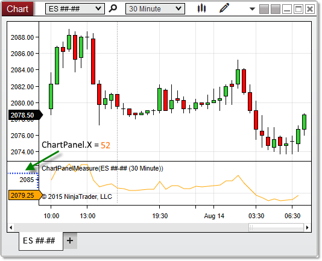

NinjaScript > Language Reference > Common > Charts > ChartPanel > X (Coordinate)
X (Coordinate)

| << [Click to Display Table of Contents](x_coordinate_chartpanel.md) >> **Navigation:**     [NinjaScript](ninjascript-1.md) > [Language Reference](language_reference_wip-1.md) > [Common](common-1.md) > [Charts](chart-1.md) > [ChartPanel](chartpanel-1.md) > X (Coordinate) | [Previous page](w_width_chartpanel-1.md) [Return to chapter overview](chartpanel-1.md) [Next page](y_coordinate_chartpanel-1.md) |
| --- | --- |

## Definition
Indicates the x-coordinate on the chart canvas at which the chart panel begins. 
## 
## Property Value
A int representing the x-coordinate at which the panel begins. This property will only contain a value greater than zero if the y-axis displays to the left of the paintable chart canvas area in the panel (if an object in the panel is using the "Left" scale justification).
 
## Syntax
ChartPanel.X
## 
## Example
| ns |
| --- |
| protected override void OnRender(ChartControl chartControl, ChartScale chartScale) {    base.OnRender(chartControl, chartScale);         // Print the coordinates of the top-left corner of the panel    Print(String.Format("The panel begins at coordinates {0},{1}",ChartPanel.X ,ChartPanel.Y)); } |

Based on the image below, X reveals that the chart panel begins at x-coordinate 52.
 

