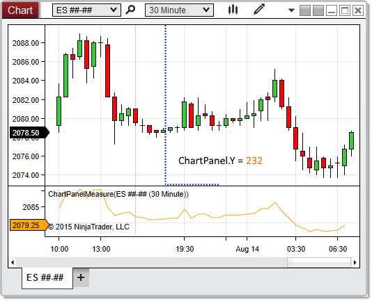


NinjaScript \> Language Reference \> Common \> Charts \> ChartPanel \> Y (Coordinate)
Y (Coordinate)

| \<\< [Click to Display Table of Contents](y_coordinate_chartpanel.md) \>\> **Navigation:**     [NinjaScript](ninjascript-1.md) \> [Language Reference](language_reference_wip-1.md) \> [Common](common-1.md) \> [Charts](chart-1.md) \> [ChartPanel](chartpanel-1.md) \> Y (Coordinate) | [Previous page](x_coordinate_chartpanel-1.md) [Return to chapter overview](chartpanel-1.md) [Next page](chartscale-1.md) |
| --- | --- |

## Definition
Indicates the y\-coordinate on the chart canvas at which the chart panel begins. 
## 
## Property Value
A int representing the y\-coordinate at which the panel begins. 
 
## Syntax
ChartPanel.Y
## 
## Example
| ns |
| --- |
| protected override void OnRender(ChartControl chartControl, ChartScale chartScale) {    base.OnRender(chartControl, chartScale);         // Print the coordinates of the top\-left corner of the panel    Print(String.Format("The panel begins at coordinates {0},{1}",ChartPanel.X ,ChartPanel.Y)); } |

Based on the image below, Y reveals that the chart panel begins at y\-coordinate 232\.
 

